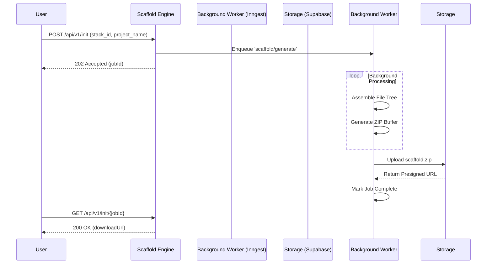

<div align="center">


<br/>

[](https://git.io/typing-svg)

<br/>

<p align="center">
  <a href="#-project-overview"><b>Features</b></a> •
  <a href="#-architecture--tech-stack"><b>Architecture</b></a> •
  <a href="#-getting-started"><b>Getting Started</b></a> •
  <a href="#-plans--pricing"><b>Pricing</b></a> •
  <a href="#-contribute"><b>Contribute</b></a>
</p>

[](#)
[](#)
[](#)

*Crafted with precision by **abd** | A **Gray Soft** Product*

<br/>

---

> 💡 **The Setup Loop is Broken** <br/>
> Every developer, solo founder, and small startup team faces the same invisible tax. Each new project requires rebuilding the exact same foundation. <br/> **Scaffold** is a **Launch OS** that eliminates repetitive setup work by giving you a persistent, personalized knowledge base of your stack, decisions, and launch playbooks.

---

</div>

<br/>

## 🚀 Project Overview

Scaffold provides everything needed to go from idea to production reliably. It orchestrates your entire development workflow, translating saved stacks into functional projects.

<div align="center">

| 🌟 Capability | 📝 Description | Status |
|:---|:---|:---:|
| 📖 **Launch Playbooks** | Structured checklists. Auto-completes steps based on your stack. | 🟢 |
| 🧩 **Code Boilerplates** | 120+ starter templates with semantic version staleness detection. | 🟢 |
| 🧠 **Stack Memory** | Remembers your toolchain. Imports directly from `package.json`. | 🟢 |
| ⚡ **One-Click Init** | Generates fully-configured project skeletons in seconds. | 🟢 |
| 📓 **Decision Log** | A searchable log of architectural decisions per user/team. | 🟢 |
| 🤝 **Team Library** | Shared playbooks, templates, and stacks for your team. | 🟢 |

</div>

<br/>

## 🛠 Architecture & Tech Stack

Scaffold is built as a **Modular Monolith** prioritizing speed, type-safety, and reliability. 

### ⚙️ Core Technologies

<div align="center">
  <a href="https://skillicons.dev">
    
  </a>
</div>
<br/>

### 🧱 Modules

| Module | Responsibility | Engine / Service |
|:---|:---|:---|
| 🔐 **M1: Identity & Auth** | User sessions, OAuth, teams | `Supabase Auth (JWT)` |
| 🗄️ **M2: Stack Memory** | Persistent tool preferences | `PostgreSQL (Supabase)` |
| 📓 **M3: Playbooks** | Launch checklists and runs | `Next.js App Router` |
| 📦 **M4: Templates** | Code boilerplates and snippets | `Upstash Redis` |
| 🏗️ **M5: Project Init** | Automated project generation | `Inngest (Background Jobs)` |
| 🔍 **M6: Decision Log** | Searchable architectural logging| `PostgreSQL pg_trgm` |

<br/>

<details>
<summary><b>📈 Click to view the architectural workflow diagram</b></summary>
<br/>


</details>

<br/>

## 💻 Getting Started

<details open>
<summary><b>1️⃣ Command Line Interface (CLI)</b></summary>
<br/>

The Scaffold CLI lets you generate projects directly from your terminal.

```bash
# Authenticate with Scaffold
$ scaffold auth login

# Generate a new project using a saved stack
$ scaffold init --stack "nextjs-saas" --name "my-awesome-project"

# List your available stacks
$ scaffold stack list
```

</details>

<details>
<summary><b>2️⃣ Local Setup</b></summary>
<br/>

To run Scaffold locally for development:

```bash
git clone https://github.com/neilkumar93600/Scaffold
cd scaffold
pnpm install
supabase start
cp .env.example .env.local
pnpm db:push
pnpm db:seed
pnpm dev
```

</details>

<details>
<summary><b>3️⃣ CI/CD Pipeline (GitHub Actions)</b></summary>
<br/>

Our deployment pipeline is fully automated, validating type safety, running tests, and pushing preview deployments.

```yaml
name: CI & Preview Deploy

on:
  push:
    branches: [main]
  pull_request:
    branches: [main]

jobs:
  quality:
    runs-on: ubuntu-latest
    steps:
      - uses: actions/checkout@v4
      - uses: pnpm/action-setup@v3
      - uses: actions/setup-node@v4
        with: 
          node-version: '20'
          cache: 'pnpm'

      - name: Install Dependencies
        run: pnpm install --frozen-lockfile

      - name: Code Quality Checks
        run: |
          pnpm typecheck
          pnpm lint

      - name: Run Tests
        run: pnpm test --run
        env:
          SUPABASE_URL: ${{ secrets.TEST_SUPABASE_URL }}
          SUPABASE_SERVICE_ROLE_KEY: ${{ secrets.TEST_SUPABASE_SERVICE_ROLE_KEY }}

  e2e:
    runs-on: ubuntu-latest
    if: github.ref == 'refs/heads/main'
    needs: quality
    steps:
      - uses: actions/checkout@v4
      - run: pnpm install --frozen-lockfile
      - run: pnpm playwright install --with-deps chromium
      - name: E2E Tests
        run: pnpm test:e2e
        env:
          E2E_BASE_URL: https://staging.scaffold.app
```

</details>

<br/>

## 💳 Plans & Pricing

<div align="center">

| Tier | Best For | Price | Core Entitlements |
|:---:|:---|:---:|:---|
| 🥉 **Free** | Trying things out | **$0** | 3 Projects, 15 Built-in Templates |
| 🥈 **Solo** | Indie Hackers | **$12/mo** | Unlimited Projects, Custom Stacks |
| 🥇 **Team** | Small Teams | **$32/mo** | Up to 8 Members, Slack Integration |
| 💎 **Studio**| Power Users | **$89/mo** | Unlimited Members, SSO Integration |

</div>

<br/>

## 🤝 Contribute

We welcome contributions from the community!

1. **Fork the repository** and create your branch from `main`.
2. **Make your changes**, ensuring tests pass and type safety is maintained.
3. **Submit a Pull Request** with a detailed description of your changes.

To report bugs or request features, please open an issue in our GitHub repository. Be sure to check existing issues before submitting a new one.

<br/>

---

<div align="center">

### 📜 License
Released under the **MIT License**. <br/>
© 2026 **Gray Soft**. All rights reserved.

<br/>

<a href="https://github.com/neilkumar93600/Scaffold">
  
</a>
<a href="https://github.com/neilkumar93600/Scaffold">
  
</a>

<br/>
Made with 💚 by <b>abd</b> & the Scaffold Team

</div>
