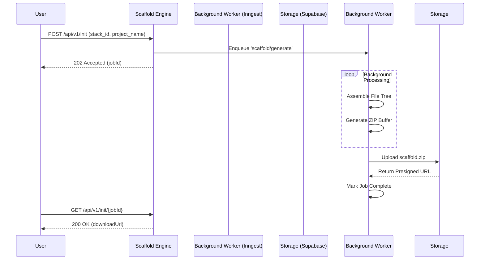

<div align="center">

<svg xmlns="http://www.w3.org/2000/svg" width="120" height="120" fill="none" viewBox="0 0 256 256" overflow="visible">
  <path d="M 64 128 L 64.5 128 L 32 95 L 0 64 L 0 0 L 64 0 L 128 64 L 128 64.5 L 161 32 L 192 0 L 256 0 L 256 64 L 192 128 L 128 128 L 128 192 L 96 223 L 63.5 256 L 0 256 L 0 192 Z M 256 192 L 224 223 L 191.5 256 L 128 256 L 128 192 L 192 128 L 256 128 Z" fill="#00E6A1" />
</svg>

# S C A F F O L D

**Stop rebuilding from scratch. Ship smarter, every time.**

<p align="center">
  <a href="#-project-overview-and-features">Features</a> •
  <a href="#-tech-stack-apis-and-other-resources">Architecture</a> •
  <a href="#-getting-started-setup-and-running-instructions">Getting Started</a> •
  <a href="#-plans--pricing">Pricing</a> •
  <a href="#-how-to-contribute-and-report-issues">Contribute</a>
</p>

[](#)
[](#)
[](#)

*Developed by **abd** | A product of **Gray Soft***

</div>

---

> Every developer, solo founder, and small startup team faces the same invisible tax: **the setup loop**. Each new project requires rebuilding the exact same foundation. <br/>**Scaffold** is a **Launch OS** that eliminates repetitive setup work by giving you a persistent, personalized knowledge base of your stack, decisions, and launch playbooks.

---

## 📝 Project Overview and Features

Scaffold provides everything needed to go from idea to production reliably. It orchestrates your entire development workflow, translating saved stacks into functional projects.

### ✨ Features at a Glance

| Capability | Description | Status |
|:---|:---|:---:|
| 🚀 **Launch Playbooks** | Structured, step-by-step checklists. Auto-completes steps based on your stack. | 🟢 |
| 🧩 **Code Boilerplates** | 120+ hand-curated starter templates with semantic version staleness detection. | 🟢 |
| 🧠 **Stack Memory** | Remembers your preferred toolchain. Imports directly from `package.json`. | 🟢 |
| ⚡ **One-Click Init** | Generates fully-configured project skeletons in seconds via Web or CLI. | 🟢 |
| 📓 **Decision Log** | A searchable log of architectural decisions per user/team. | 🟢 |
| 🤝 **Team Library** | Shared playbooks, templates, and stacks for your entire team. Slack integration. | 🟢 |

<br/>

### ⚙️ Workflow Orchestration

<details>
<summary><b>Click to view the architectural workflow diagram</b></summary>
<br/>


</details>

---

## ⛏️ Tech Stack, APIs, and Other Resources

Scaffold is built as a **Modular Monolith** prioritizing speed, type-safety, and reliability. 

| Module | Responsibility | Core Tech Stack |
|:---|:---|:---|
| **M1: Identity & Auth** | User sessions, OAuth, teams | Supabase Auth `(JWT)` |
| **M2: Stack Memory** | Persistent tool preferences | PostgreSQL `(Supabase)` |
| **M3: Playbooks** | Launch checklists and runs | Next.js `(App Router)` |
| **M4: Templates** | Code boilerplates and snippets | Upstash Redis `(Caching)` |
| **M5: Project Init** | Automated project generation | Inngest `(Background Jobs)` |
| **M6: Decision Log** | Searchable architectural logging | PostgreSQL `pg_trgm` |

---

## 🧑‍💻 Getting Started: Setup and Running Instructions

<details open>
<summary><b>1. CLI Usage</b></summary>
<br/>

The Scaffold CLI lets you generate projects directly from your terminal.

```bash
# Authenticate with Scaffold
$ scaffold auth login

# Generate a new project using a saved stack
$ scaffold init --stack "nextjs-saas" --name "my-awesome-project"

# List your available stacks
$ scaffold stack list
```

</details>

<details>
<summary><b>2. Local Setup</b></summary>
<br/>

To run Scaffold locally for development:

```bash
git clone https://github.com/[org]/scaffold
cd scaffold
pnpm install
supabase start
cp .env.example .env.local
pnpm db:push
pnpm db:seed
pnpm dev
```

</details>

<details>
<summary><b>3. CI/CD Pipeline (GitHub Actions)</b></summary>
<br/>

Our deployment pipeline is fully automated, validating type safety, running tests, and pushing preview deployments.

```yaml
name: CI & Preview Deploy

on:
  push:
    branches: [main]
  pull_request:
    branches: [main]

jobs:
  quality:
    runs-on: ubuntu-latest
    steps:
      - uses: actions/checkout@v4
      - uses: pnpm/action-setup@v3
      - uses: actions/setup-node@v4
        with: 
          node-version: '20'
          cache: 'pnpm'

      - name: Install Dependencies
        run: pnpm install --frozen-lockfile

      - name: Code Quality Checks
        run: |
          pnpm typecheck
          pnpm lint

      - name: Run Tests
        run: pnpm test --run
        env:
          SUPABASE_URL: ${{ secrets.TEST_SUPABASE_URL }}
          SUPABASE_SERVICE_ROLE_KEY: ${{ secrets.TEST_SUPABASE_SERVICE_ROLE_KEY }}

  e2e:
    runs-on: ubuntu-latest
    if: github.ref == 'refs/heads/main'
    needs: quality
    steps:
      - uses: actions/checkout@v4
      - run: pnpm install --frozen-lockfile
      - run: pnpm playwright install --with-deps chromium
      - name: E2E Tests
        run: pnpm test:e2e
        env:
          E2E_BASE_URL: https://staging.scaffold.app
```

</details>

---

## 💳 Plans & Pricing

| Tier | Best For | Price | Core Entitlements |
|:---|:---|:---|:---|
| 🥉 **Free** | Trying things out | **$0** | 3 Projects, 15 Built-in Templates |
| 🥈 **Solo** | Indie Hackers | **$12/mo** | Unlimited Projects, Custom Stacks, All Templates |
| 🥇 **Team** | Small Teams | **$32/mo** | Up to 8 Members, Shared Library, Slack Integration |
| 💎 **Studio**| Power Users | **$89/mo** | Unlimited Members, API Access, SSO Integration |

---

## 🤝 How to Contribute and Report Issues

We welcome contributions from the community!

1. **Fork the repository** and create your branch from `main`.
2. **Make your changes**, ensuring tests pass and type safety is maintained.
3. **Submit a Pull Request** with a detailed description of your changes.

To report bugs or request features, please open an issue in our GitHub repository using the provided issue templates. Be sure to check existing issues before submitting a new one.

---

## 🔥 Conclusion and License

Scaffold is proudly built and maintained by **abd**. 

> **License**: MIT License <br/>
> © 2026 **Gray Soft**. All rights reserved.

<div align="center">
  <br/>
  Made with 💚 by the Scaffold Team
</div>
